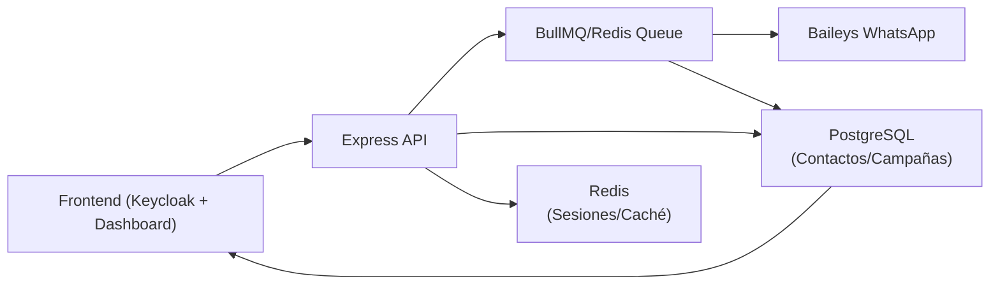
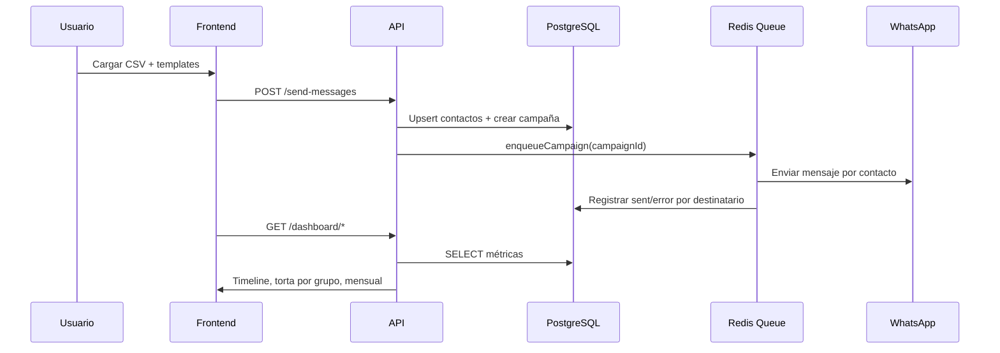
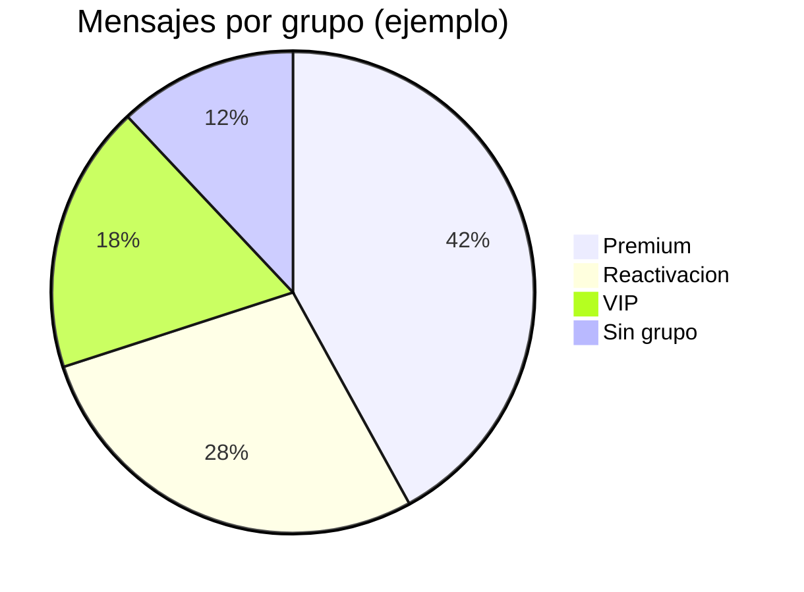

# WhatsApp Message Sender

Sistema profesional de envío masivo de mensajes por WhatsApp con arquitectura multi-cliente, gestión de cola inteligente y deployment automatizado. Implementado con Baileys y diseñado para producción.

## 🚀 Características Principales

### 📨 **Envío de Mensajes**
- **Envío masivo** desde archivos CSV con orden preservado
- **Importación de contactos desde CSV** con `nombre`, `sustantivo` y `grupo`
- **Gestión manual de contactos** (alta/edición/eliminación)
- **Mensajes de texto** con soporte para emojis
- **Imágenes individuales** con caption personalizado
- **Múltiples imágenes** por mensaje
- **Mensajes de voz** (audio MP3/M4A con conversión automática a Opus)
- **Sistema de cola** con procesamiento ordenado y reintentos automáticos
- **Limpieza automática** de archivos de audio después del envío

### 🔧 **Arquitectura Técnica**
- **Backend**: Node.js 20+ con Express
- **WhatsApp Integration**: @whiskeysockets/baileys (socket-based)
- **Base de datos**: PostgreSQL 16 con persistencia Longhorn (K8s)
- **Caché/Colas**: Redis 7.2 con BullMQ
- **Almacenamiento**: MinIO/S3 para archivos multimedia
- **Autenticación**: Keycloak con bypass para desarrollo
- **Frontend**: Bootstrap con emoji picker y actualizaciones en tiempo real
- **Containerización**: Docker con multi-stage builds
- **CI/CD**: GitHub Actions para deployment automático

### 🏢 **Multi-Cliente**
- **Arquitectura de ramas**: Una rama por cliente (`cliente-3000`, `cliente-3011`, etc.)
- **Configuración independiente**: Cada cliente con su `.env` y puerto específico
- **Deployment aislado**: GitHub Actions deploy por rama automáticamente
- **Nginx Proxy Manager**: Compatible para gestión de dominios

## 📋 Requisitos

- **Node.js**: >= 20 (requerido por Baileys)
- **Docker & Docker Compose**: Para deployment en producción
- **Git**: Para manejo de ramas por cliente
- **Nginx Proxy Manager**: Recomendado para gestión de dominios

## 🛠️ Instalación y Configuración

### 1. **Setup de Desarrollo**
```bash
git clone https://github.com/poravv/message-sender.git
cd message-sender
npm install --legacy-peer-deps
cp .env.example .env
npm start
```

### 2. **Variables de Entorno (.env)**
```env
# Servidor
PORT=3000                # Desarrollo local (Kubernetes usa 3010)
NODE_ENV=production

# App
AUTHORIZED_PHONES=595992756462,595976947110
FILE_RETENTION_HOURS=24
MESSAGE_DELAY_MS=2000

# Keycloak (obligatorio en producción)
KEYCLOAK_URL=https://auth.mindtechpy.net
KEYCLOAK_REALM=message-sender
KEYCLOAK_AUDIENCE=message-sender-api

# PostgreSQL (persistencia principal)
POSTGRES_HOST=localhost
POSTGRES_PORT=5432
POSTGRES_USER=sender
POSTGRES_PASSWORD=changeme
POSTGRES_DB=sender

# Redis (sesiones y cola)
SESSION_STORE=redis
REDIS_HOST=redis.mindtechpy.net
REDIS_PORT=6379
REDIS_PASSWORD=changeme
REDIS_DB=0
REDIS_TLS=false                 # true si el endpoint ofrece TLS
REDIS_TLS_REJECT_UNAUTHORIZED=true
REDIS_TTL_SECONDS=43200         # 12h para credenciales/keys
REDIS_QR_TTL_SECONDS=180        # 3m para QR temporal

# MinIO/S3 (archivos multimedia)
MINIO_ENDPOINT=s3.mindtechpy.net
MINIO_ACCESS_KEY=...
MINIO_SECRET_KEY=...
MINIO_BUCKET=sender

# Logs (opcional)
# LOG_LEVEL=info
```

## 🏗️ Deployment en Producción (Kubernetes)

### CI/CD
- El workflow `.github/workflows/deploy.yml` compila y publica la imagen en GHCR y despliega en el clúster al hacer push a `main`.
- Requiere un runner `self-hosted` con `docker` y `kubectl` configurado contra tu clúster.

### Manifests incluidos (namespace: `sender`)
- `k8s/namespace.yaml` — crea el namespace `sender`.
- `k8s/configmap.yaml` — configuración no sensible (PORT=3010 en K8s, TTLs, LOG_LEVEL, KEYCLOAK_* por defecto).
- `k8s/postgresql.yaml` — PostgreSQL 16 con Longhorn PVC (5Gi), Secret e init SQL.
- `k8s/backend-deployment.yaml` — Deployment/Service/HPA del backend.
  - Deployment: `sender-backend` (puerto contenedor 3010)
  - Service: `sender-backend-service` (ClusterIP 3010)
  - Readiness/Liveness: `/health` en 3010
- `k8s/ingress.yaml` — Ingress HTTPS para `sender.mindtechpy.net` (cert-manager `letsencrypt-prod`).

### Variables desde GitHub Secrets
- Secret `backend-env-secrets` se recrea en cada deploy con tus Secrets:
  - `NODE_ENV`, `KEYCLOAK_URL`, `KEYCLOAK_REALM`, `KEYCLOAK_AUDIENCE`
  - `SESSION_STORE`, `AUTHORIZED_PHONES`, `FILE_RETENTION_HOURS`, `MESSAGE_DELAY_MS`, `LOG_LEVEL`
  - Redis: `REDIS_URL`, `REDIS_HOST`, `REDIS_PORT`, `REDIS_DB`, `REDIS_TLS`, `REDIS_PASSWORD`
  - PostgreSQL: `POSTGRES_HOST`, `POSTGRES_PORT`, `POSTGRES_USER`, `POSTGRES_PASSWORD`, `POSTGRES_DB`
  - MinIO: `MINIO_ENDPOINT`, `MINIO_ACCESS_KEY`, `MINIO_SECRET_KEY`, `MINIO_BUCKET`
- Asegúrate de definirlos en Settings → Secrets and variables → Actions.

### Puertos y acceso
- Desarrollo local: `http://localhost:3000`
- Kubernetes: Ingress en `https://sender.mindtechpy.net` → Service `sender-backend-service:3010`.

### PostgreSQL + Redis (almacenamiento híbrido)
- **PostgreSQL**: Base de datos principal para contactos, campañas y métricas. Desplegado con Longhorn PVC para persistencia.
- **Redis**: Sesiones de WhatsApp, cola BullMQ y caché. Externo (redis.mindtechpy.net).
- El backend auto-selecciona PostgreSQL si `POSTGRES_HOST` está definido, sino usa Redis como fallback.
- **Botón Limpiar Caché**: En el dashboard puedes limpiar el caché Redis de tu usuario (métricas, contactos temporales).
### Docker Compose (local)
```bash
docker compose up -d
open http://localhost:3000
```

## 📊 Características Funcionales

### **Gestión de Mensajes**
- ✅ **CSV Processing**: Carga y valida números desde CSV
- ✅ **Contact Management**: CRUD de contactos por usuario autenticado
- ✅ **Campaign History**: Persistencia de campañas, destinatarios y resultados
- ✅ **Queue Management**: Cola FIFO con manejo de errores
- ✅ **Retry Logic**: 3 reintentos automáticos con backoff exponencial
- ✅ **Progress Tracking**: Monitoreo en tiempo real del progreso
- ✅ **Audio Processing**: Conversión automática a formato Opus
- ✅ **File Cleanup**: Eliminación automática de archivos temporales

### **Conexión WhatsApp**
- ✅ **Baileys Integration**: Socket-based connection con Node.js 20
- ✅ **Session Management**: Persistencia de sesiones en Redis (TTL configurable)
- ✅ **QR Generation**: Generación automática de QR para autenticación
- ✅ **Auto Reconnection**: Reconexión automática con exponential backoff
- ✅ **User Info Capture**: Captura de número y nombre del usuario conectado
- ✅ **Inactivity Management**: Desconexión automática después de 30 minutos

### **Frontend Interactivo**
- ✅ **Responsive Design**: Bootstrap 5 con diseño mobile-first
- ✅ **Emoji Picker**: 9 categorías de emojis con búsqueda
- ✅ **Real-time Updates**: Polling cada 15 segundos para estado
- ✅ **Progress Bar**: Visualización del progreso de envío en tiempo real
- ✅ **Dashboard**: Línea de tiempo, torta por grupos y métricas mensuales
- ✅ **Error Handling**: Manejo elegante de errores con alertas
- ✅ **Keycloak Integration**: Autenticación empresarial opcional

## 📁 Estructura de Archivos CSV

### Formato básico (compatibilidad)
```csv
595992756462
595976947110
595984123456
```

### Formato recomendado (con personalización)
```csv
numero,sustantivo,nombre,grupo
595992756462,Sr,Carlos Gómez,Premium
595976947110,Sra,Ana Benítez,Reactivacion
595984123456,Dr,José Acosta,VIP
```

- **Formato**: número obligatorio, columnas adicionales opcionales.
- **Prefijo**: se normaliza a código de país Paraguay (`595`).
- **Variables disponibles**: `{sustantivo}`, `{nombre}`, `{grupo}`.

## 📈 Gráficos en Markdown (Mermaid)

### Arquitectura funcional


### Flujo de campaña con tracking


### Ejemplo de distribución por grupo


> 📖 **Más diagramas**: Ver [docs/ARCHITECTURE.md](docs/ARCHITECTURE.md) para diagramas detallados de la arquitectura, flujos de datos, esquema de BD y deployment K8s.

## 🔌 Endpoints Nuevos (resumen)

### Contactos
- `POST /contacts` crear contacto manual
- `PUT /contacts/:contactId` editar contacto
- `GET /contacts` listar contactos con filtros
- `DELETE /contacts/:contactId` eliminar contacto
- `POST /contacts/import` importar desde CSV
- `GET /contacts/groups` listar grupos únicos

### Dashboard
- `GET /dashboard/summary` resumen por rango
- `GET /dashboard/timeline` línea de tiempo (`hour|day|month`)
- `GET /dashboard/by-group` distribución por grupo
- `GET /dashboard/by-contact` top contactos
- `GET /dashboard/current-month` métricas del mes actual
- `GET /dashboard/monthly` tendencia mensual

### Campañas
- `GET /campaigns/:id` detalle de campaña
- `POST /cancel-campaign` cancelar campaña activa

### Cache
- `DELETE /cache/user` **NUEVO** - Limpiar caché Redis del usuario actual

## ⚡ Rendimiento y Límites

| Tipo de Mensaje | Velocidad | Límite |
|-----------------|-----------|---------|
| Texto | ~500/10 segundos | WhatsApp API |
| Imagen | ~500/8 minutos | Tamaño: 16MB |
| Audio | ~300/10 minutos | Duración: 2min |
| Reconexiones | 5 intentos | Backoff exponencial |
| Reintentos | 3 por mensaje | Cola automática |

## 🔧 Monitoreo y Logs

### **Logs del Sistema**
```bash
# Ver logs en tiempo real
docker compose logs -f

# Logs específicos por contenedor
docker compose logs audio-sender

# Logs de deployment
# Se muestran automáticamente en GitHub Actions
```

### **Directorios Importantes**
- 📁 `/uploads/`: Archivos temporales (auto-limpieza)
- 📁 `/bot_sessions/`: Datos de sesión WhatsApp (persistente)
- 📁 `/temp/`: Archivos de audio convertidos (auto-limpieza)
- 📁 `/logs/`: Logs de aplicación (rotación automática)

## 🔒 Seguridad

- 🔐 **Keycloak Authentication**: Autenticación empresarial obligatoria en producción
- 🛡️ **CORS Protection**: Orígenes permitidos configurables
- 📝 **Input Validation**: Validación de archivos y números de teléfono
- 🧹 **Auto Cleanup**: Limpieza automática de archivos sensibles
- 🔄 **Session Management**: Manejo seguro de sesiones WhatsApp
- 🚫 **Rate Limiting**: Protección contra abuso (configurable)

## 🐛 Solución de Problemas

### **Problemas de Conexión**
```bash
# Verificar estado del contenedor
docker compose ps

# Ver logs detallados
docker compose logs --tail=50

# Reiniciar servicio
docker compose restart

# Verificar conectividad
curl http://localhost:3000/connection-status
```

### **Problemas de Audio**
- ✅ **Formatos soportados**: MP3, M4A, WAV, OGG
- ✅ **Conversión automática**: A formato Opus para WhatsApp
- ✅ **Limpieza automática**: Archivos eliminados después del envío
- ❌ **Error común**: Verificar permisos de directorio `/temp/`

### **Problemas de Deployment**
```bash
# Error: Directorio no existe
# Solución: Ejecutar setup manual primero

# Error: .env no encontrado  
# Solución: Crear .env con variables requeridas

# Error: Puerto en uso
# Solución: Verificar conflictos con netstat -tuln | grep :3000
```

## 🔄 Mantenimiento

### **Tareas Regulares**
- 📅 **Monitoring**: Verificar estado de contenedores diariamente
- 🧹 **Cleanup**: Los archivos temporales se limpian automáticamente
- 🔄 **Updates**: Deployment automático via GitHub Actions
- 💾 **Backups**: Respaldar `/bot_sessions/` semanalmente

### **Comandos Útiles**
```bash
# Estado de todos los clientes
for dir in /home/elporavv/workspaceandre/clientes/*/message-sender; do
    echo "=== $(basename $(dirname $dir)) ==="
    cd "$dir" && docker compose ps
done

# Logs de todos los clientes
for dir in /home/elporavv/workspaceandre/clientes/*/message-sender; do
    echo "=== $(basename $(dirname $dir)) ==="
    cd "$dir" && docker compose logs --tail=10
done
```

## 📞 Soporte

**Desarrollado por**: Andrés Vera  
**WhatsApp**: +595 992 756462  
**Website**: mindtechpy.net  
**GitHub**: poravv/message-sender

---

## 📄 Licencia

ISC License - Ver archivo LICENSE para más detalles.
