# Arquitectura del Sistema

Este documento describe la arquitectura técnica del sistema WhatsApp Message Sender con diagramas Mermaid.

## 📋 Índice

- [Vista General](#vista-general)
- [Componentes](#componentes)
- [Flujo de Datos](#flujo-de-datos)
- [Persistencia](#persistencia)
- [Kubernetes](#kubernetes)

---

## Vista General

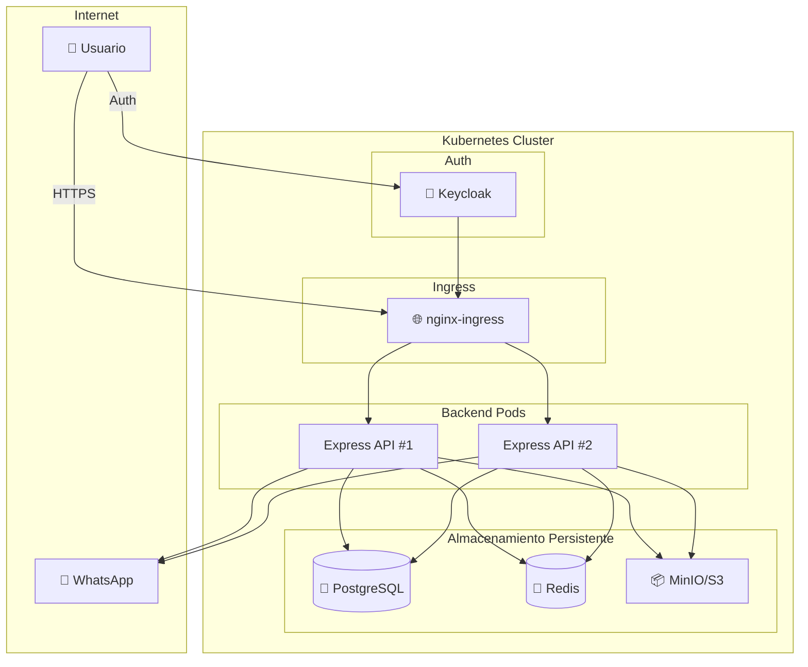

---

## Componentes

### Frontend (SPA)

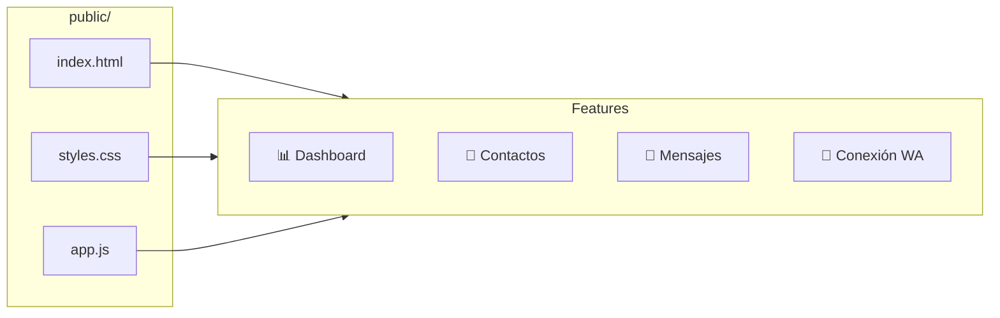

### Backend (Node.js/Express)

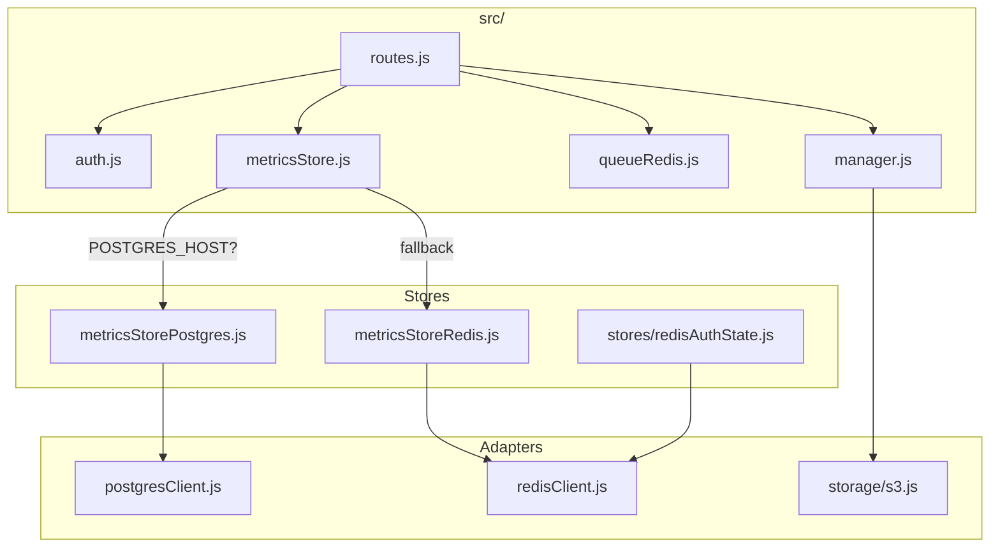

### Selección de Backend de Persistencia

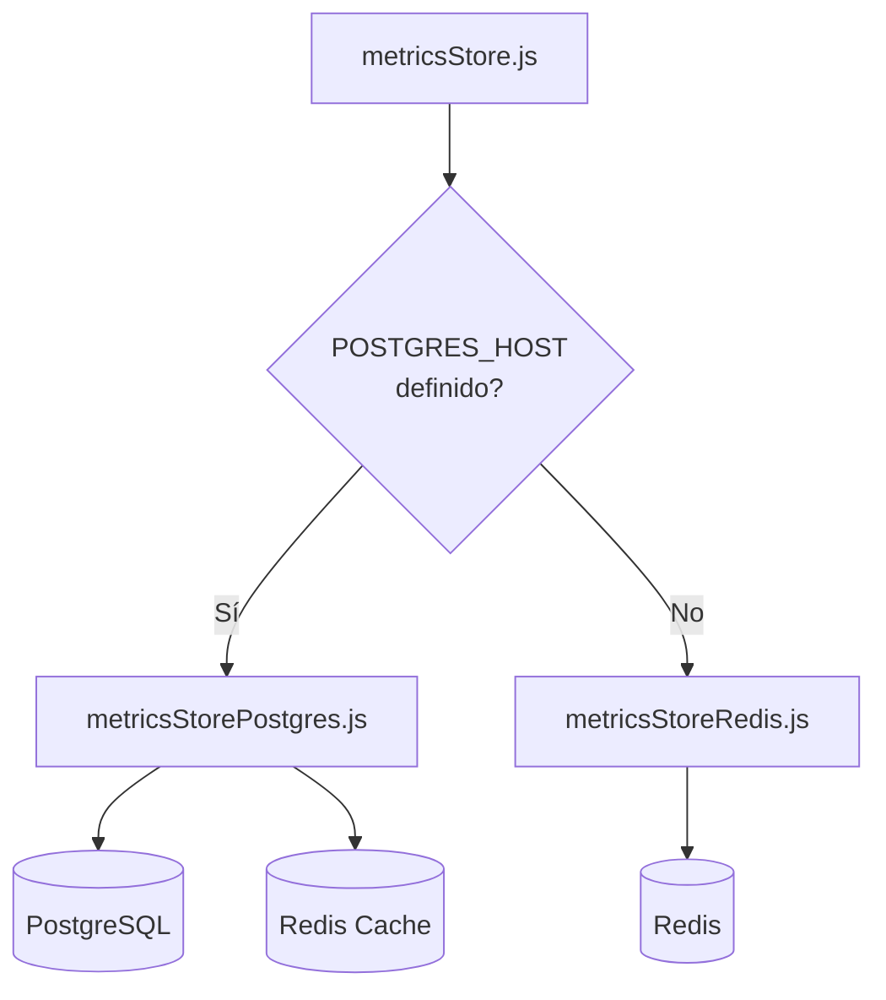

---

## Flujo de Datos

### Envío de Campaña

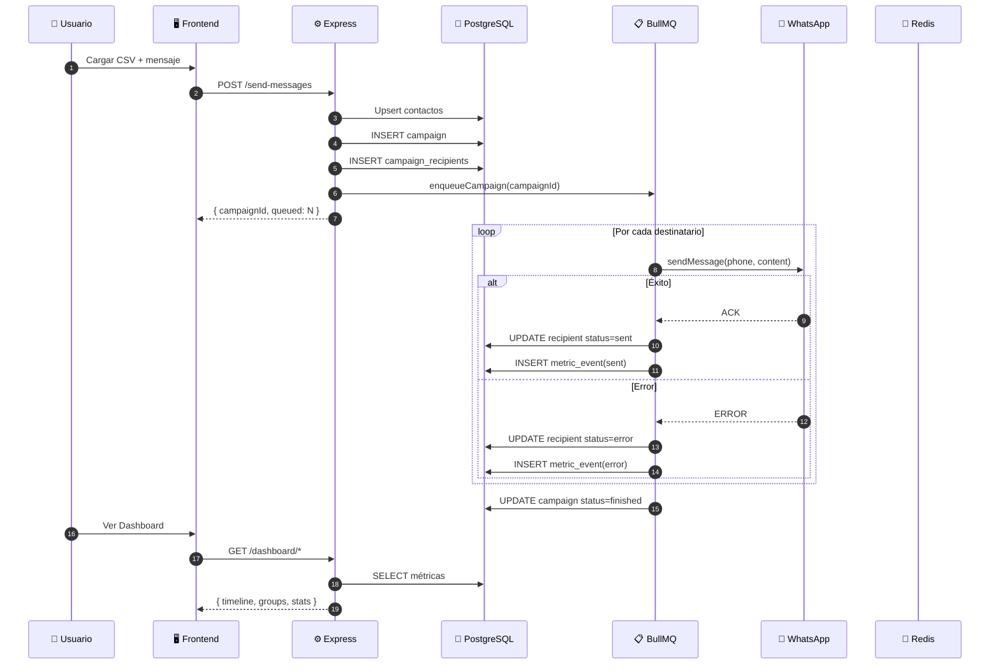

### Conexión WhatsApp

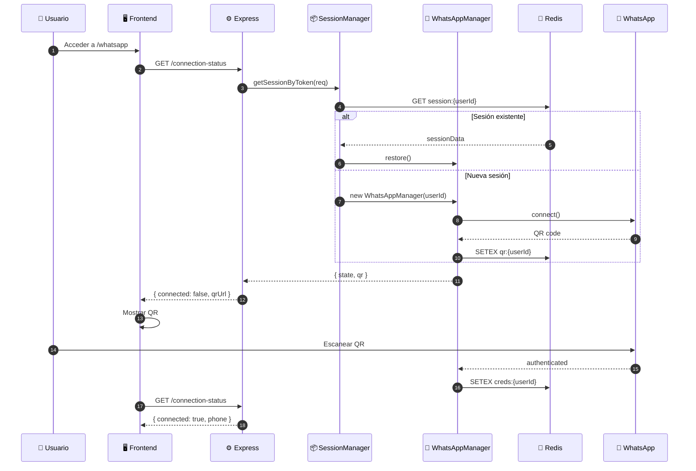

### Limpiar Caché de Usuario

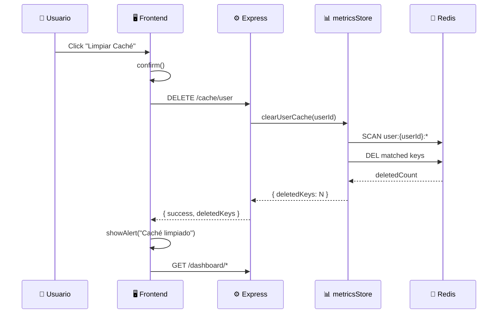

---

## Persistencia

### Esquema de Base de Datos (PostgreSQL)

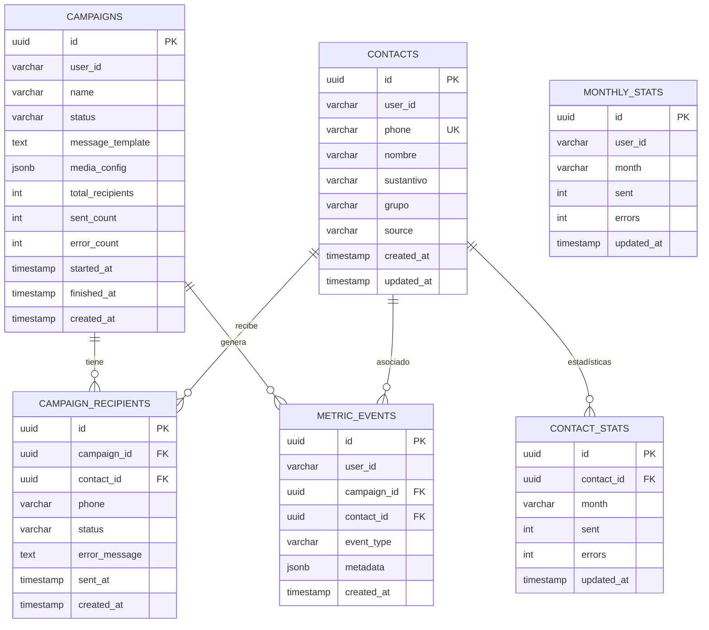

### Claves Redis

```mermaid
flowchart LR
    subgraph SessionKeys["Sesiones WhatsApp"]
        S1[wa:session:{userId}:creds]
        S2[wa:session:{userId}:keys:*]
        S3[qr:{userId}]
    end
    
    subgraph QueueKeys["Cola BullMQ"]
        Q1[bull:whatsapp-queue:*]
        Q2[bull:whatsapp-queue:jobs:{jobId}]
    end
    
    subgraph CacheKeys["Caché Métricas (fallback)"]
        C1[user:{userId}:contacts:*]
        C2[user:{userId}:campaigns:*]
        C3[user:{userId}:metrics:*]
    end
    
    subgraph LockKeys["Distributed Locks"]
        L1[lock:{resourceId}]
        L2[owner:{resourceId}]
    end
```

---

## Kubernetes

### Deployment Architecture

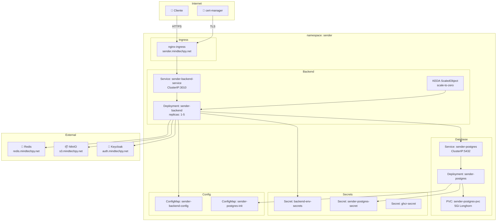

### CI/CD Pipeline

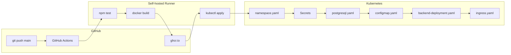

---

## Métricas y Monitoreo

### Dashboard Overview

```mermaid
flowchart TB
    subgraph KPIs["KPIs Mensuales"]
        K1[📤 Enviados<br/>este mes]
        K2[❌ Errores<br/>este mes]
        K3[📊 Tasa éxito<br/>%]
        K4[📈 Promedio<br/>diario]
    end
    
    subgraph Charts["Gráficos"]
        C1[📈 Timeline<br/>Tendencia diaria]
        C2[🥧 Pie Chart<br/>Por grupo]
        C3[🏆 Top 10<br/>Contactos]
    end
    
    subgraph Data["Fuentes de Datos"]
        D1[/dashboard/current-month]
        D2[/dashboard/timeline]
        D3[/dashboard/by-group]
        D4[/dashboard/by-contact]
    end
    
    D1 --> KPIs
    D2 --> C1
    D3 --> C2
    D4 --> C3
```

---

## Seguridad

```mermaid
flowchart TB
    subgraph Auth["Autenticación"]
        KC[Keycloak OIDC]
        JWT[JWT Validation]
        Roles[Role-based Access]
    end
    
    subgraph Transport["Transporte"]
        TLS[TLS 1.3]
        HTTPS[HTTPS Only]
        CORS[CORS Policy]
    end
    
    subgraph Data["Datos"]
        Encrypt[Encryption at Rest<br/>Longhorn]
        Secrets[K8s Secrets]
        TTL[Redis TTL]
    end
    
    subgraph App["Aplicación"]
        Input[Input Validation]
        RateLimit[Rate Limiting]
        Sanitize[XSS Prevention]
    end
    
    KC --> JWT --> Roles
    TLS --> HTTPS --> CORS
    Encrypt --> Secrets --> TTL
    Input --> RateLimit --> Sanitize
```
